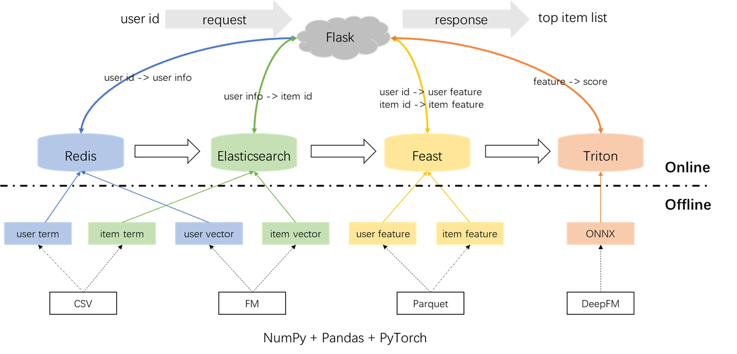
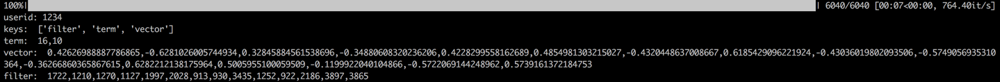
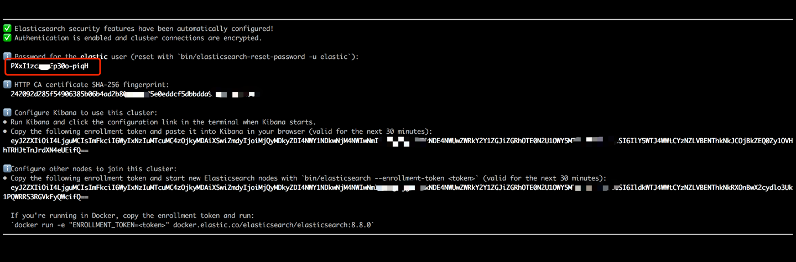
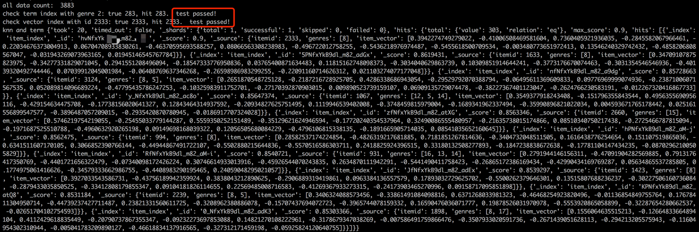
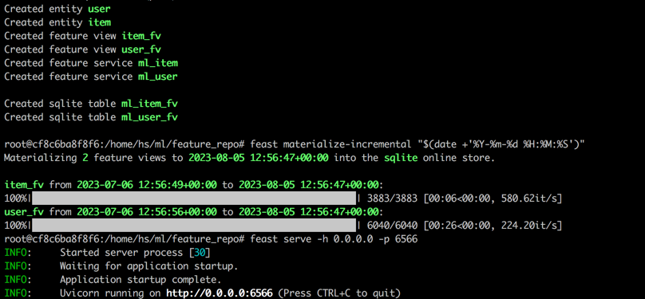
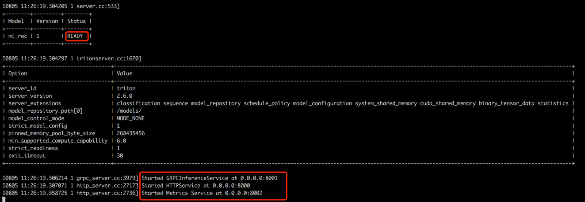
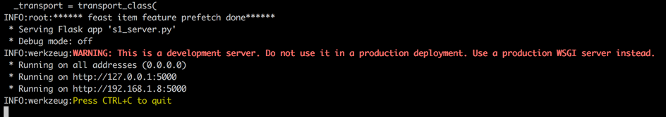
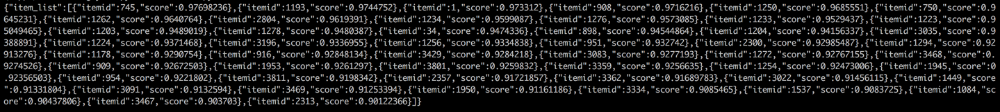

Build Recommender System with PyTorch + Redis + Elasticsearch + Feast + Triton + Flask. Term / Vector Recall, DeepFM Ranking, Inference Engine and Web Application.
=================

English | [中文](./readme.md)

Using the popular MovieLens dataset as an example, introduce recommender system pipeline from offline to online, with all operations can be performed on a single laptop. Although many components are used, everything is contained within Conda and Docker, so there will be no impact on the local environment.

- In Conda environment, install pandas and PyTorch for offline data processing and model training, simulating an industrial HDFS storage -> Spark ETL -> GPU cluster training pipeline.  
- In Conda environment, install Flask as the web server, simulating an industrial Java Spring backend.  
- In Docker, install Redis, Elasticsearch, Feast Feature Store, and Triton Inference Server, simulating industrial RPC calls from a backend to other components. Specifically, Redis is used to store user terms and vectors required for recall, Elasticsearch is used to build item term index and vector index required for recall, Feast is used to store user and item features required for ranking, and Triton is used as a real-time predicting engine for ranking.  

The overall architecture of the recommender system is shown below. Now, let's go through the development and deployment process for the recall and ranking modules in three phases: offline, offline to online, and online.  



# 1 Offline
## 1.0 Conda Environment 
```bash
conda create -n rsppl python=3.8
conda activate rsppl
conda install --file requirements.txt --channel anaconda --channel conda-forge
```

## 1.1 Preprocessing
```bash
cd offline/preprocess/
python s1_data_split.py
python s2_term_trans.py
```
Preprocessing on labels, samples, and features:

- Labels: There are far more implicit feedback recommender systems (click/no click) than explicit feedback recommender systems (ratings). Therefore, we converted the movielens dataset into an implicit feedback dataset: ratings greater than 3 are considered positive samples, and ratings less than or equal to 3 are considered negative samples. In total there are 575,281 positive samples and 424,928 negative samples.
- Samples: We sorted the rating actions of each user by timestamp. For each user, the last 10 rated items are used for online evaluation (60,400 in total). For the remaining samples, the first 80% of rated items for each user are used as the offline trainset (754,233 in total), and the last 20% are used as the offline testset (185,576 in total).
- Features: Sparse features are encoded into integer sequences starting from 0.

It's worth noting the point-in-time joins in the s2_term_trans.py file. That is, when generating offline training samples (imp_term.pkl), features at or before the time of action that are closest to now should be used. Using features after would result in feature leakage, and features before but far from now would lead to inconsistency between online and offline. In contrast, the newest features should be used for online serving (user_term.pkl and item_term.pkl). 

## 1.2 Term / Vector Recall
```bash
cd offline/recall/
python s1_term_recall.py
python s2_vector_recall.py
```
Term recall: uses the genre list the user has interacted with in a past time window, i.e. match user preferences with item genres. Terms will be loaded into Redis and ES later.

Vector recall: uses FM (Factorization Machines) with only userid and itemid as features. AUC is 0.8081. After training, user and item vectors are extracted from the model checkpoint and will be loaded into Redis and ES later.

## 1.3 Feature Engineering and DeepFM Ranking
```bash
cd offline/rank/
python s1_feature_engi.py
python s2_model_train.py
```
There are 59 features in total, including three types: one-hot (userid, itemid, gender, etc.), multi-hot (genres), and dense (historical behavioral statistics).

Use DeepFM as the ranking model, achieving an AUC of 0.8206. [pytorch-fm](https://github.com/rixwew/pytorch-fm) is an elegant package for FM-based algorithms, but has two drawbacks: 1. It only supports sparse features, not dense; 2. All sparse features must have the same dimension, which violates the intuition that "ID embeddings should be high-dimensional, while side info embeddings should be low-dimensional". Therefore, we did not directly install and use pytorch-fm. Instead, we made some modifications to the source code to enable support for both dense features and different embedding dimensions for sparse features. Additionally, it was observed that the deep embedding part hurt model performance, so this was removed. As a result, the model structure is essentially a sparse FM + dense MLP, not a typical DeepFM.

# 2 Offline2Online
## 2.0 Docker Images
To avoid impacting the local environment, Redis, Elasticsearch, Feast, and Triton are all used in Docker containers. Download the images (need to ensure [docker](https://www.docker.com/)  has been installed on the laptop).
```bash
docker pull redis:6.0.0
docker pull elasticsearch:8.8.0
docker pull feastdev/feature-server:0.31.0
docker pull nvcr.io/nvidia/tritonserver:20.12-py3
```

## 2.1 User Terms and Vectors to Redis
[Redis](https://redis.io/) is used to store user information required for recall.

Start Redis container.
```bash
docker run --name redis -p 6379:6379 -d redis:6.0.0
```
Loading the user's term, vector, and filter into Redis, where term and vector are generated in section 1.2, and filter refers to items the user has interacted with in the past - these need to be filtered out when making recommendations.

After loading the data, validation by checking a sample user's data will be performed. The output shown below indicates successful validation. 
```bash
cd offline_to_online/recall/
python s1_user_to_redis.py
```



## 2.2 Item Terms and Vectors to Elasticsearch
[Elasticsearch](https://www.elastic.co/)  is used to construct inverted index and vector index for items. It was originally used in search domains - the most basic usage is using words to retrieve documents. If we treat an item as a doc, and its terms (e.g. movie genres) as words, we can leverage ES to retrieve items by terms. This is the concept of inverted indexes, so Elasticsearch is also often used for term recall in recommender systems. For vector recall, a typical tool is Facebook's open-sourced faiss, but for ease of integration we will use Elasticsearch's vector retrieval capabilities here. Elasticsearch has supported vector retrieval since version 7, and approximate KNN retrieval since version 8. We install a version 8+ here, because precise KNN retrieval almost can't meet the low latency requirements.

Start Elasticsearch container and enter the internal terminal.
```bash
docker run --name es8 -p 9200:9200 -it elasticsearch:8.8.0
```
Copy the password shown in your terminal output (as shown below), and paste it as the value for ES_KEY in data_exchange_center/constants.py. This is because Elasticsearch has required password authentication from version 8.   

  

After pasting, ctrl+C (or command+C) to exit the internal terminal. This will also stop the container, so we need to restart the ES container and keep it running in the background.  
```bash
docker start es8
```
Load the item terms to build the term index, and load the item vectors to build the vector index. In industry, the two indexes are separated for better performance and flexibility. But for simplicity here we combine them into one index.

After loading the data, validation by checking a sample item's term and vector will be performed. The output shown below indicates successful validation.  
```bash
cd offline_to_online/recall/
python s2_item_to_es.py
```



## 2.3 User and Item Features to Feast
[Feast](https://feast.dev/) is the first open-sourced feature store, which is historically significant. Feast includes offline and online parts - the offline part mainly provides point-in-time joins, but since we handled PIT in pandas ourselves, there is no need to use Feast's offline part, we only need to leverage it as an online feature store. As for why not use Feast for PIT, it is because Feast itself only has feature storage capabilities, without feature engineering capabilities (some simple transformations have been supported in the latest version). Most companies still prefer customized feature engines with more powerful capabilities, so there is no need to spend too much time learning its offline usage. It's better to use more general tools like pandas or Spark to process features, and only use Feast as an offline-online feature transporter.

Convert the feature files from CSV to Parquet format to meet Feast's requirements.
```bash
cd offline_to_online/rank/
python s1_feature_to_feast.py
```
Open a new terminal (called terminal 2), start Feast container with 6566 as the HTTP port and enter the internal terminal. 
```bash
cd data_exchange_center/online/feast
docker run --rm --name feast-server --entrypoint "bash" -v $(pwd):/home/hs -p 6566:6566 -it feastdev/feature-server:0.31.0
```
Execute following commands in the docker container's internal terminal.
```bash
# Enter the config directory
cd /home/hs/ml/feature_repo
# Initialize the feature store from config files (read parquet to build databse)
feast apply
# Features are loaded from offline to online (defaults to sqlite, with options like Redis available)
feast materialize-incremental "$(date +'%Y-%m-%d %H:%M:%S')"
# Start the feature server
feast serve -h 0.0.0.0 -p 6566
```
After completing all steps, the output below will be shown.

  

Back to terminal 1, execute the following command to test if Feast is serving properly. If successful, it will return a json string.
```bash
curl -X POST \
  "http://localhost:6566/get-online-features" \
  -d '{
    "feature_service": "ml_item",
    "entities": {
      "itemid": [1,3,5]
    }
  }'
```

## 2.4 PyTorch to ONNX to Triton
[Triton(Triton Inference Server)](https://developer.nvidia.com/triton-inference-server)  is an open-sourced inference serving engine provided by Nvidia that supports TensorFlow, PyTorch, ONNX and more. Although it's developed by Nvidia, it can also serve with CPUs, so feel free to use it. A more common solution in industry is TensorFlow -> SavedModel -> TF Serving. But Triton is promising due to its flexibility to switch between different backends. Therefore, here we use a PyTorch -> ONNX -> Triton Server pipeline.

Convert PyTorch Model to ONNX.
```bash
cd offline_to_online/rank/
python s2_model_to_triton.py
```
Open a new terminal (called terminal 3), start Triton container with 8000 as the HTTP port and 8001 as the gRPC port.
```bash
cd data_exchange_center/online/triton
docker run --rm -p8000:8000 -p8001:8001 -p8002:8002 -v $(pwd)/:/models/ nvcr.io/nvidia/tritonserver:20.12-py3 tritonserver --model-repository=/models/
```


  
Back to terminal 1, run the script to test if offline and online predicting score are consistent.
```bash
cd offline_to_online/rank/
python s3_check_offline_and_online.py
```    
As shown, offline and online scores are identical, test passed.


# 3 Online
## 3.1 Server
In industry, engineers generally use Java + SpringBoot or Go + Gin as the recommender system backend. But here, for ease of environment integration, Python + Flask is used. Django, Flask, FastAPI, and Tornado are common Python web frameworks that all provide the capability to route REST API requests to functions for processing. Any of them could meet our needs, we randomly chose [Flask](https://flask.palletsprojects.com/en/2.3.x/).

Open a new terminal (called terminal 4), start Flask web server with 5000 as the HTTP port.
```bash
conda activate rsppl
cd online/main
flask --app s1_server.py run --host=0.0.0.0
```

 

## 3.2 Client
Back to terminal 1, test calling from a client (here client refers to the upstream service calling the recommendation service, not user devices). Json-formatted recommendation results are returned, with the top 50 list shown below. The downstream service takes these items to retrieve corresponding attributes and returns them to the client (user device). A full recommendation flow is now completed.
```bash
cd online/main
python s2_client.py
```

